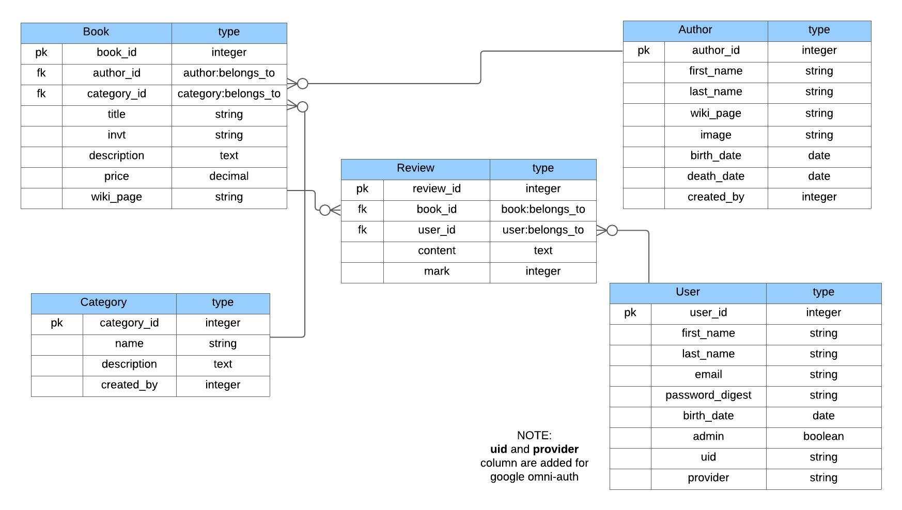

# 📚 Book Store Project 📚
___


This application is meant to be a place for users to add authors, books or categories,  and reviews about books. This way users can keep track of all books they read, find some new books for future reads based on other users' reviews, online resources about books or authors. All in all, it's meant to inspire us to enjoy reading books and learning new things about authors. 


___

## Table of Content</spam>
- [📚 Book Store Project 📚](#-book-store-project-)
  - [Table of Content</spam>](#table-of-contentspam)
  - [Description](#description)
  - [Specification](#specification)
      - [Versioning](#versioning)
      - [System dependencies](#system-dependencies)
      - [Database](#database)
  - [Instalation](#instalation)
  - [How To Use](#how-to-use)
  - [Tests](#tests)
      - [Model testing](#model-testing)
      - [Route testing](#route-testing)
  - [Future uppgrades](#future-uppgrades)
  - [Contributing](#contributing)
      - [Code of Conduct](#code-of-conduct)
  - [Bugs](#bugs)
  - [License](#license)

___
##  Description


___


## Specification
#### Versioning
This application is writen in Ruby programming language version: 
`ruby 2.6.1p33 (2019-01-30 revision 66950) [x86_64-darwin20]`

With Ruby on Rails framework version: 
`Rails 6.1.4`

<spam style="color:yellow">*NOTE: This can be checked by running `ruby -v ` and `rails -v ` in root folder of this application.* </spam>

#### System dependencies
  - Saving hashed passwords into database: 
  
  ```
  'bcrypt', '~> 3.1.7'
  ``` 
  - Authentication with google: 
  ```
'omniauth'
'omniauth-google-oauth2'
'omniauth-rails_csrf_protection'
  ```
 - Styling and icons:
  ```
'bootsnap'
'bootstrap-sass', '~> 3.1.1'
'font-awesome-rails'
'font-awesome-sass', '~> 5.15.1'
  ```
  - Testing
  ```
'capybara', '>= 3.26'
'rspec-rails', ">=3.9.0"
  ```
All gems used in this application can be found in `Gemfile`

#### Database
Database used for building this application is `SQLite`, version: `SQLite version 3.36.0`. 

<spam style="color:yellow">*NOTE: This can be checked by running `rails db`.* </spam>


*<p align="center"> Database schema </p>*

___
## Instalation

1. **<spam style="color:green">fork**</spam> this this repository
2. **<spam style="color:green">clone**</spam> this (with SSH key) to your local environment
3. **<spam style="color:green">navigate**</spam> to root directory
4. **<spam style="color:green">run</spam>** `bundle install` to track and install the exact gems and versions that are needed.
5. **<spam style="color:green">run</spam>** `rails db:migrate` to change database schema based of migrations (found id `./db/migrate/...`)
6. **<spam style="color:green">run</spam>** `rails db:seed` to seed database with dummy data so we would have data to work with
7. **<spam style="color:green">run</spam>** `rails server` to start *localhost* on port *3000*
8. **<spam style="color:green">navigate</spam>** browser to `http://localhost:3000/` where our application is being hosted

 ___

##  How To Use

After all steps from **Installation** are done we can check three pages in our application without signing or logging in, _HOME_, _ABOUT_, and _CONTACT_. 
Logging in and signing in is possible through _GOOGLE_ or simply creating a new user via the form provided and then later on logging in using email and password.
After we are logged in we gain access to the _BOOKS_, _AUTHORS_, _CATEGORIES_. All these newly added pages have lists of respective entities and we can visit their show, edit, and new pages.
In the end, we have a PROFILE page of a current user where all activities will be shown.
___
## Tests
All tests are located in the **spec** folder and they are divided into folders based on what are they testing(models, routing,...).

To run all the tests we need to <spam style="color:green">run</spam> `rspec spec` command in our terminal.
#### Model testing
All model tests are located at `./spec/models/` folder, devided into different files, one file for one model(`author_spec.rb` test file  for `author.rb` model).

To <spam style="color:green">run</spam> all model tests: `rspec spec/models`.

To <spam style="color:green">run</spam> specific model tests: `rspec spec/models/--file_name--`
#### Route testing
All routes tests are located at `./spec/routing/add_routing_spec.rb`.

To <spam style="color:green">run</spam> all routes tests: `rspec spec/routing` or `rspec spec/routing/add_routing_spec.rb` since there is only one file it *routing folder*.

___
## Future uppgrades
- [x] Fix readme.md 
- [x] Add tests for routes
- [x] Add tests for models 
- [ ] Add tests for controller
- [ ] More functionality for users profile page
- [ ] Use `active-storage` gem for saving files instad of links to images on web  
___
##  Contributing

When contributing to this repository, please first discuss the change you wish to make via  <a href="mailto:zivkovicmilan1987@gmail.com">email</a>, or any other method with the owners of this repository before making a change.

Please note we have a code of conduct, please follow it in all your interactions with the project.

#### Code of Conduct
Our Pledge
In the interest of fostering an open and welcoming environment, we as contributors and maintainers pledge to making participation in our project and our community a harassment-free experience for everyone, regardless of age, body size, disability, ethnicity, gender identity and expression, level of experience, nationality, personal appearance, race, religion, or sexual identity and orientation.

Our Standards
Examples of behavior that contributes to creating a positive environment include:

Using welcoming and inclusive language
Being respectful of differing viewpoints and experiences
Gracefully accepting constructive criticism
Focusing on what is best for the community
Showing empathy towards other community members
Examples of unacceptable behavior by participants include:

The use of sexualized language or imagery and unwelcome sexual attention or advances
Trolling, insulting/derogatory comments, and personal or political attacks
Public or private harassment
Publishing others' private information, such as a physical or electronic address, without explicit permission
Other conduct which could reasonably be considered inappropriate in a professional setting
Our Responsibilities
Project maintainers are responsible for clarifying the standards of acceptable behavior and are expected to take appropriate and fair corrective action in response to any instances of unacceptable behavior.

Project maintainers have the right and responsibility to remove, edit, or reject comments, commits, code, wiki edits, issues, and other contributions that are not aligned to this Code of Conduct, or to ban temporarily or permanently any contributor for other behaviors that they deem inappropriate, threatening, offensive, or harmful.

**Scope**

This Code of Conduct applies both within project spaces and in public spaces when an individual is representing the project or its community. Examples of representing a project or community include using an official project e-mail address, posting via an official social media account, or acting as an appointed representative at an online or offline event. Representation of a project may be further defined and clarified by project maintainers.

**Enforcement**

Instances of abusive, harassing, or otherwise unacceptable behavior may be reported by contacting the project team at <a href="mailto:zivkovicmilan1987@gmail.com">email</a>. All complaints will be reviewed and investigated and will result in a response that is deemed necessary and appropriate to the circumstances. The project team is obligated to maintain confidentiality with regard to the reporter of an incident. Further details of specific enforcement policies may be posted separately.

Project maintainers who do not follow or enforce the Code of Conduct in good faith may face temporary or permanent repercussions as determined by other members of the project's leadership.

___
## Bugs

Let us know if you find any issues or bugs via email <a href="mailto:zivkovicmilan1987@gmail.com">here</a>.

Thank you.
___
##   License
This application is avaiable as open source under the terms of the [MIT License](LICENSE).
___
